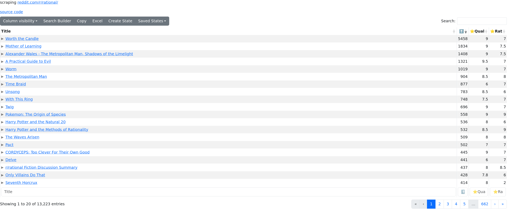

# rrational

scrapping reddit.com/r/rational and analytics

see https://raw.githubusercontent.com/NightMachinery/.shells/master/scripts/python/reddit/subreddit2org.py

This project has data from r/rational in plan text that you can browse, see <./data/cache2/> for the data.

This project also has a table you can at https://wassname.github.io/scrape_r_rational/

https://wassname.github.io/scrape_r_rational/

## Project plan:

- [x] Init
- [x] Fill out README
- [x] Scrape r/rational
- [x] use [statistics](https://github.com/wassname/scrape_r_rational/blob/main/nbs/links.csv)
- [x] Use llm to get reccomendations, sentiment, karma etc
- [x] share
- [x] comment md to html
- [x] comment expand
- [x] threads where it's mentioned
- [x] better tittles and data cleaning
- [x] github pages

## Install requirements

This project uses [poetry](https://python-poetry.org/) for requirement and is set up for torch using cuda.
~~~
poetry install
~~~

Then 
~~~
cp .env.example .env
~~~
Then fill out the api keys

## How to run

First run <nbs/mjc_001_download.ipynb> to update the data in <data/cache2/>

Then run <nbs/mjc_004_process.ipynb> to analyse the data and output <index.html>

05 to run an llm (costs around $50)

